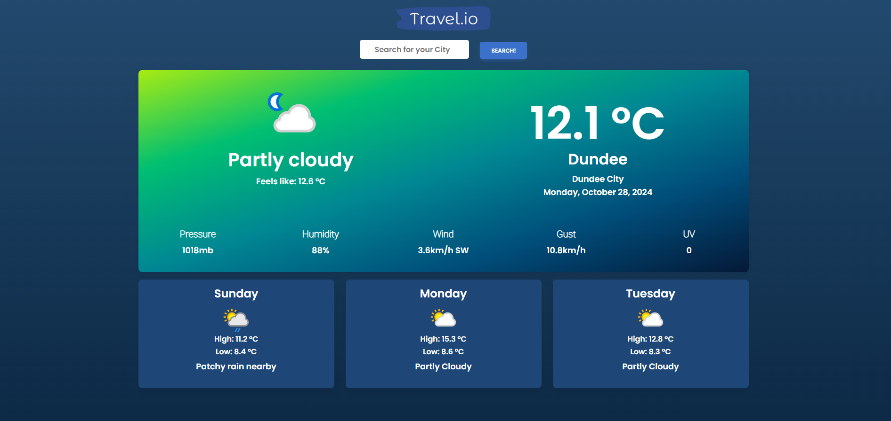

*A web app that combines two APIs to make a useful application*

**[See the app here](https://varendraaa.github.io/Weather-App-API-Mashup/)**

## About
This was my second assignment for my Web Development Module at the University of Dundee.
It's written using HTML, CSS and Javascript, with support from JQuery and Material Design Bootstrap.
It was my first time working with Javascript and the JSON notation, and was developed over a period of 4 weeks.

It uses two API's for its functionality:
- [Weather API](https://www.weatherapi.com/)
- [Ticketmaster API](https://developer.ticketmaster.com/products-and-docs/apis/discovery-api/v2/)

Initially, I looked at all freely available API's from this convenient [repository](https://github.com/public-apis/public-apis) and tried to figure out two things:

1. What app would I actually be interested in making?
2. What two API's would function well together to make a useful application?

I decided on putting together the two aforementioned API's to create an application that allows a user to check both the weather forecast and upcoming events in the area, simply by inputing a designated location. I was also inspired by the Windows 11 Weather app.

 

## Design
The initial layout was built based on a basic wireframe design of my concept in Mockflow (Figma was not something I was familiar with, nor had time to get familiar with).

I initially planned to integrate a geocoding API such as Mapbox API to generate a real-time weather map, but WeatherAPI did not support map tiling so I could not.

## Development

After the initial design was mocked up, I started on developing a base boilerplate website utilising the Material Design Bootstrap (MDB) framework as well as it offered a simple to use, responsive, mobile-first building toolkit. It alos allows every element to scale well across different platforms.

The JQuery API was also used to facilitate easy Document Object Model (DOM) traversal. 

I then iterated between using Javascript to fetch API information to create objects that would be inserted into the various sections and then adjusting the HTML and CSS to ensure that the overall framing of the website would stay the same. As mentioned before, the interactive weather map implementation was not feasible due to the Weather API limitations, so the design was subsequently adjusted.

Since this was my first time working with API data calls and the JSON format, I spent some time getting used to the particular data structures for the different platforms. 

I ran into an issue where the API data for the Weather API was very inconsistent in the dimensions for the icon images for different weather conditions. It essentially contained multiple images of differing sizes, aspect ratio and resolutions. This meant that   sometimes they would render incorrectly or be incredibly pixelated. I resolved this by ensuring that all images present in the API were rendered to a set 16:9 ratio.

I also opted for a very basic colour scheme that had good contrast, which was checked using the colour contrast checker from Coolors.co. Some improvements could be made but, being colourblind myself (deuteranopia), I chose safe colours that I could see well.

