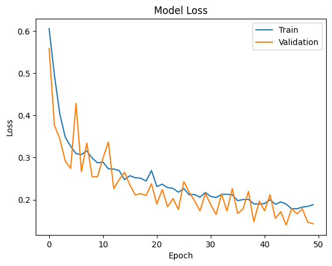

*Using Convoluted Neural Networks to detect signs of diseases in medical images.*

 
I'm currently redoing this project, based on some improvements shown to me by my classmate, Hannah Gordon. I'm also planning to separate the binary classification and multi-class classification into seperate posts for brevity's sake.


This project, undertaken as part of Machine Learning Module at the University of Dundee, focuses on using deep learning to classify medical images. It evaluates the performance of the neural network architectures across binary and multi-class classification tasks, showcasing the potential of machine learning in healthcare applications.

</br>

# Background

[MedMNIST](https://medmnist.github.io/) is a collection of 10 datasets of 28x28 pixel medical images. For this project, two different datasets were chosen, one for binary classification and one for multi-class classification.
Each dataset was evaluated using three different networks:

1. **Sample ConvNet** : A baseline convolutional neural network provided as part of the coursework.
2. **Dense-Only Network** : A fully connected network without convolutional layers but with comparable total parameters to the baseline ConvNet.
3. **Custom ConvNet** : A self-designed deep neural network incorporating advanced design principles, regularization methods, and data augmentation to optimize performance.

</br>

The networks were built using **Google Colab** for a couple reasons:

1. The cloud platform meant that there were no incompatibilities between different framework versions. 
2. Testing and adjusting network models in the cloud was far easier and didn't require dedicated GPUs.

The two chosen datasets were:

1. **PneumoniaMNIST** for binary classification (presence or absence of pneumonia).
2. **OrganCMNIST** for multi-class classification (predicting organ types).

</br>

# Part 1: Binary Classification of Pneumonia Images

## Baseline Convnet

First, I looked at the sample covnet provided by the University, which consisted of the following architecture:
- Two convolutional layers with ReLU activation and max pooling.
- A dense output layer with a softmax activation function.
- Total params: 18379 
- Trainable params: 18379

```s
from keras import layers
from keras import models

model_1 = models.Sequential()
model_1.add(keras.layers.Conv2D(32, (3, 3), activation='relu', input_shape=(28, 28, 1)))
model_1.add(keras.layers.MaxPooling2D((2, 2)))

model_1.add(keras.layers.Conv2D(32, (3, 3), activation='relu'))
model_1.add(keras.layers.MaxPooling2D((2, 2)))

model_1.add(layers.Flatten())
model_1.add(layers.Dense(11, activation='softmax'))

model_1.summary()

```

The model was compiled using stochastic gradient descent (SGD) with a learning rate of 0.001 and evaluated using binary cross-entropy loss.

``` s
model_1.compile(optimizer=keras.optimizers.SGD(learning_rate=0.001),
              loss='binary_crossentropy',
              metrics=['accuracy'])
```

// Add  Results  here


</br>


## Dense Network (Without Convolutions)

To look at the importance of spatial feature extraction, a dense-only network was also tested. This network replaced convolutional layers with fully connected layers, while keeping the total parameter count similar to the ConvNet.

Architecture Details:
1. Input images were flattened into 1D arrays.
2. Three fully connected layers with 128, 64, and 32 neurons, respectively.
3. Dropout layers were added to prevent overfitting.

```s
from keras import layers, models

model_dense = models.Sequential()
model_dense.add(layers.Flatten(input_shape=(28, 28, 1)))    # Flattening the image
model_dense.add(layers.Dense(128, activation='relu'))
model_dense.add(layers.Dropout(0.3))                        # Regularization
model_dense.add(layers.Dense(64, activation='relu'))
model_dense.add(layers.Dropout(0.3))
model_dense.add(layers.Dense(1, activation='sigmoid'))      # Sigmoid activation

model_dense.compile(optimizer='adam',
                    loss='binary_crossentropy',
                    metrics=['accuracy'])

```

// Add results here


Challenges Observed:

- Dense networks struggled to capture spatial patterns in the images, resulting in lower performance compared to ConvNets.
- Dropout regularization improved generalization but did not fully bridge the performance gap.

Key Insights:
- Dense layers alone lack the ability to identify localized features, highlighting the importance of convolutions for tasks involving image data.

</br>

## Custom Convnet

The custom ConvNet incorporated the following enhancements:

1. Depth and Complexity: Increased convolutional layers to capture more detailed features.
2. Regularization: Added dropout layers after each dense layer to prevent overfitting.
3. Batch Normalization: Improved training stability.
4. Data Augmentation: Improved dataset diversity with transformations like rotation, flipping, and zoom.

```s

from keras.preprocessing.image import ImageDataGenerator

# Data augmentation
datagen = ImageDataGenerator(rotation_range=20, width_shift_range=0.2, height_shift_range=0.2, horizontal_flip=True)

# Custom ConvNet
model_custom = models.Sequential()
model_custom.add(layers.Conv2D(32, (3, 3), activation='relu', input_shape=(28, 28, 1)))
model_custom.add(layers.BatchNormalization())
model_custom.add(layers.MaxPooling2D((2, 2)))
model_custom.add(layers.Dropout(0.3))  # Regularization

model_custom.add(layers.Conv2D(64, (3, 3), activation='relu'))
model_custom.add(layers.BatchNormalization())
model_custom.add(layers.MaxPooling2D((2, 2)))
model_custom.add(layers.Dropout(0.4))

model_custom.add(layers.Flatten())
model_custom.add(layers.Dense(128, activation='relu'))
model_custom.add(layers.Dropout(0.5))
model_custom.add(layers.Dense(1, activation='sigmoid'))  # Sigmoid activation

model_custom.compile(optimizer='adam',
                     loss='binary_crossentropy',
                     metrics=['accuracy'])


```




Results:
The custom ConvNet achieved the best performance among the three models, with significantly improved accuracy and generalization.

Key Design Takeaways:

- Batch normalization and dropout worked synergistically to stabilize training and reduce overfitting.
- Data augmentation allowed the model to learn more robust representations.


</br>

# Part 2: Multi-Class classification of Organ Images


## Baseline ConvNet
The baseline ConvNet, adapted for multi-class classification, consisted of two convolutional layers followed by a softmax-activated dense output layer for probability distributions.
- Two convolutional layers with ReLU activation and max-pooling.
- A dense output layer with softmax activation for multi-class probability distributions.
- Total parameters: 18,379


```s
model_1 = models.Sequential()
model_1.add(layers.Conv2D(32, (3, 3), activation='relu', input_shape=(28, 28, 1)))
model_1.add(layers.MaxPooling2D((2, 2)))

model_1.add(layers.Conv2D(32, (3, 3), activation='relu'))
model_1.add(layers.MaxPooling2D((2, 2)))

model_1.add(layers.Flatten())
model_1.add(layers.Dense(11, activation='softmax'))  # Softmax for multi-class

model_1.compile(optimizer='adam',
                loss='categorical_crossentropy',
                metrics=['accuracy'])

```

// Add results here


## Dense Network (Without Convolutions)
For multi-class classification, the dense network used three fully connected layers with dropout for regularization.

- Three fully connected layers with 128, 64, and 32 neurons, respectively.
- Dropout layers for regularization.
- Softmax activation in the output layer to produce class probabilities.

```s

model_dense = models.Sequential()
model_dense.add(layers.Flatten(input_shape=(28, 28, 1)))
model_dense.add(layers.Dense(128, activation='relu'))
model_dense.add(layers.Dropout(0.3))
model_dense.add(layers.Dense(64, activation='relu'))
model_dense.add(layers.Dropout(0.3))
model_dense.add(layers.Dense(11, activation='softmax'))  # 11 classes

model_dense.compile(optimizer='adam',
                    loss='categorical_crossentropy',
                    metrics=['accuracy'])


```


// Add results here

## Custom ConvNet
The custom ConvNet was enhanced for multi-class classification by:

- Increased Depth: Added a third convolutional layer for deeper feature extraction.
- Regularization: Introduced higher dropout rates and learning rate scheduling


```s
model_custom = models.Sequential()
model_custom.add(layers.Conv2D(32, (3, 3), activation='relu', input_shape=(28, 28, 1)))
model_custom.add(layers.BatchNormalization())
model_custom.add(layers.MaxPooling2D((2, 2)))
model_custom.add(layers.Dropout(0.3))

model_custom.add(layers.Conv2D(64, (3, 3), activation='relu'))
model_custom.add(layers.BatchNormalization())
model_custom.add(layers.MaxPooling2D((2, 2)))
model_custom.add(layers.Dropout(0.4))

model_custom.add(layers.Conv2D(128, (3, 3), activation='relu'))
model_custom.add(layers.BatchNormalization())
model_custom.add(layers.MaxPooling2D((2, 2)))
model_custom.add(layers.Dropout(0.5))

model_custom.add(layers.Flatten())
model_custom.add(layers.Dense(256, activation='relu'))
model_custom.add(layers.Dropout(0.5))
model_custom.add(layers.Dense(11, activation='softmax'))

model_custom.compile(optimizer='adam',
                     loss='categorical_crossentropy',
                     metrics=['accuracy'])

```

// Add results here

Key Insights
1. ConvNets Perform Better: Convolutional layers consistently outperformed dense-only networks in image-based tasks.
2. Regularization Works: Dropout, batch normalization, and data augmentation reduced overfitting.
3. Custom Architectures Excel: Tailored designs provided the best performance across both tasks.