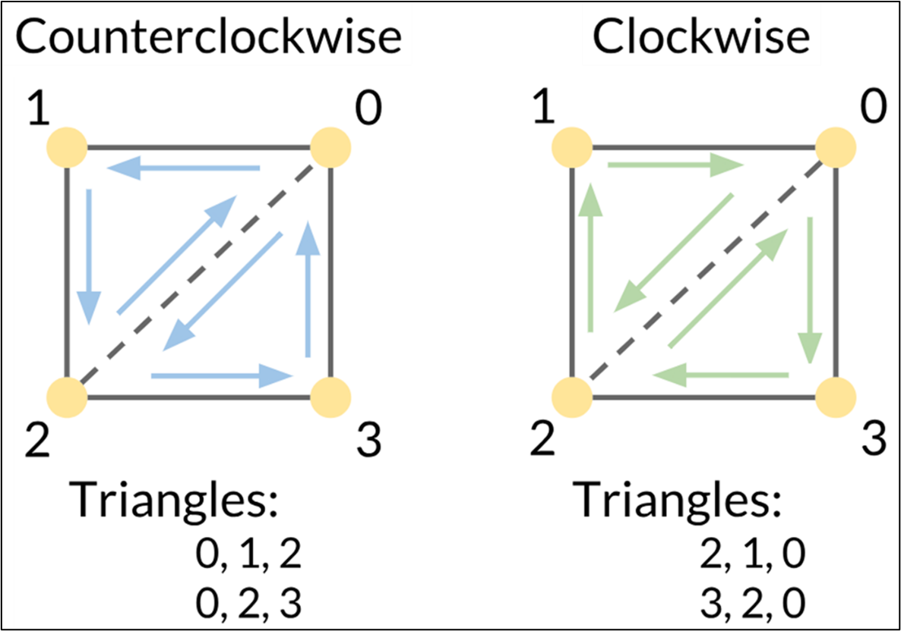
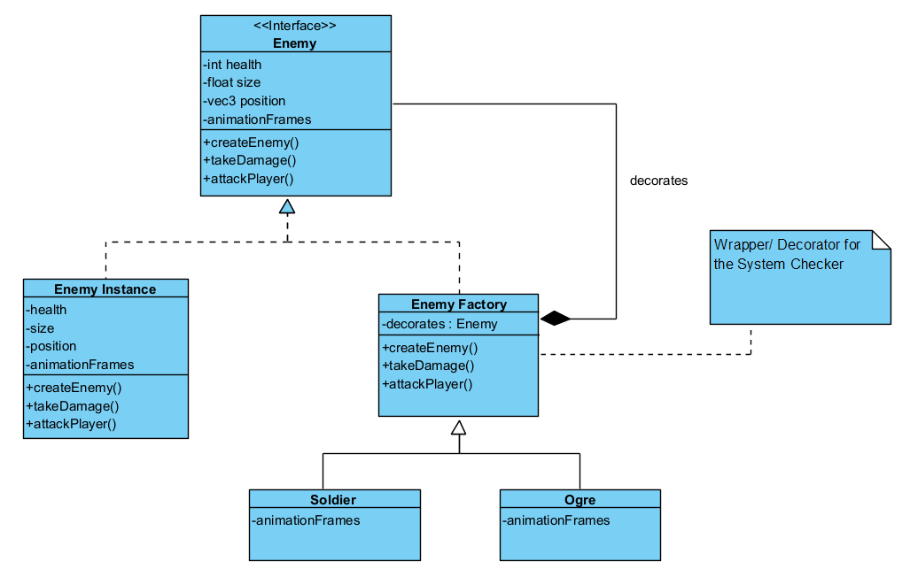
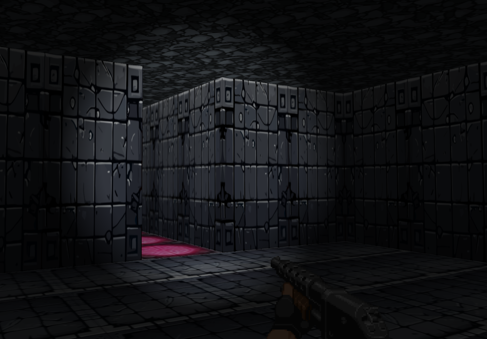

*Developing a custom game and its engine from scratch.*

This is a very summarised overview of my MSc Thesis Project, done at the University of Dundee. It focuses on the creation and development of a Doom-like 3D FPS game, and its underlying engine, completely from first principles. It utilises simple, open-source C++ libraries to support some features, but every other aspect was done manually by the game code.

Since my thesis was over 17 000 words, this project post is not meant to be a deep dive into how I solved or implemented some of the game features. If you're interested in reading it (it's a good read!), shoot me an email.

**[Check out the project code here!](https://github.com/Varendraaa/Shadow)**

## Background

I had a couple projects that I was interested in doing for my thesis project:
- A Spacecraft Mission Visualiser program, for S.T.A.R Dundee's PANGU project.
- A Computer Vision System for Soil Evaluation (the old geoscientist in me was screaming "**Put me in chief!**")
- Create a 3D Game, and its underlying engine code.

I ultimately decided to go with the game engine development for the following reasons:
1. It was something I'd be excited to develop, and therefore avoid falling into the trap that is *lack of motivation.*
2. It offered me the opportunity to learn about graphics programming, specifically about OpenGL.
3. It was a **really cool idea.** I mean, I'm making a game that people could later play, and enjoy. **EXTREMELY DOPE.**

However, I severely underestimated the sheer amount of work required to get a good game going. My supervisor, Dr. Iain Martin, and I set out a goal of getting the core game done within 8-9 weeks, to allow enough time for revision, modification and other improvements. Since this was my first foray into learning both **graphics programming** and **game development**, *without the use of a commercial engine*, I ended up working maybe 12-15 hours a day, learning as I went along.

The first couple weeks was spent getting up to speed with understanding OpenGL and the graphics pipeline. Some fantastic resources I used were:
- [LearnOpenGL](https://learnopengl.com)
- [OpenGL-tutorial](https://www.opengl-tutorial.org/)
- [FreeCodeCamp's OpenGL Tutorials by Victor Gordon](https://www.youtube.com/watch?v=45MIykWJ-C4)


## Specifications

The game is a 3D Dungeon Crawler First Person Shooter, inspired by Doom. 
It, and it's engine, which I titled "Shadow" (just a working title that ended up sticking), was entirely coded using **C++ 17** and **GLSL (OpenGL Shading Language)**. Several other C++ libraries were used for different purposes, as detailed below.

| Library       | Usage |
| -----         | ----- |
| **GLAD**      | OpenGL library that manages functions and pointers for OpenGL, allowing for flexible cross-platform development.  |
| **GLFW**      | OpenGL library that manages windowing and input/output handling for the engine implementation.                    |
| **GLM**       | OpenGL Mathematics library that provides classes and functions that operate with the OpenGL framework. Used to support matrix, vector and shader calculations.                                                                                             |
| **ImGui**     | Lightweight C++ graphical user interface (GUI) library that operates within the 3D graphics pipeline. It outputs interfaces via vertex buffers, allowing for fast rendering implementations.                                                          |
| **irrKlang**  | Cross platform sound library that manages sound playback throughout the game engine implementation.                |
| **stb**       | Lightweight, single file C++ library used to load image data, in this case textures, into our game implementation.    |
| **tmxlite**   | Lightweight C++ library that enables easy parsing of data from the .tmx files that were used to configure level data. |


Additionally, the **Tiled Map Editor** was used to create the .tmx files, which holds the layout data necessary for generating level terrain (walls, ceilings and floors), their corresponding textures, enemy spawns and item locations. It allows for easy modification and reconfiguration of the level design, and facilitates easy addition of new textures and enemy types.


# Features
The following are some of the more complex features I integrated into the game system.

###  Optimised Level Creation
The game's levels were generated using the Tiled Map Editor as a tool to allow easy modification. Tiled stores the layout data in essentially what is a 2D integer array of x-z positions in different object layers. I used this, along with the humble cube, to generate the 3D levels.

```c
<layer id="1" name="Walls" width="40" height="30">
  <data encoding="csv">
0,1,1,1,1,1,1,1,1,1,1,1,1,1,0,0,0,0,1,1,1,1,1,1,1,1,1,1,1,1,1,1,1,1,1,1,1,1,1,1,
1,0,0,0,0,0,0,0,0,0,0,0,0,0,1,0,0,0,1,0,0,0,0,0,0,0,0,0,0,0,0,0,0,0,0,0,0,0,0,1,
1,0,0,0,0,0,0,0,0,0,0,0,0,0,1,0,0,0,1,0,0,0,0,0,0,0,0,0,0,0,0,0,0,0,0,0,0,0,0,1,
1,0,0,0,0,0,0,0,0,0,0,0,0,0,1,0,0,0,1,0,0,0,0,0,0,0,0,0,0,0,0,0,0,0,0,0,0,0,0,1,
1,0,0,0,0,0,0,0,0,0,0,0,0,0,1,0,0,0,1,0,0,0,0,0,0,0,0,0,0,0,0,0,0,0,0,0,0,0,0,1,
1,0,0,0,0,0,0,0,0,0,0,0,0,0,1,0,0,0,1,0,0,0,0,0,0,0,0,0,0,0,0,0,0,0,0,0,0,0,0,1,
1,1,1,1,1,1,0,0,0,1,1,1,1,1,0,0,0,0,1,0,0,0,0,0,0,0,0,0,0,0,0,0,0,0,0,0,0,0,0,1,
</data>

```

Each occurrence of the **number 1** in the above 40 x 30 array indicates the presence of a cube, at different x-z locations, with a texture ID of **1**. Therefore, to generate walls, we could stack these cubes right next to each other, which eliminates the need to create and calculate the individual 3D vertices for each face orientation (left, right, forward, backward, up, down).


To address the removal of unneeded geometry, that would be invisible to the player, I created a system using **OpenGL's vertex winding order**. In OpenGL, triangle primitives have two faces, a front face and a back face. The face type is determined by the order of the three vertices that make up the triangle, and by default, the front face is determined if the winding order of the vertices are counterclockwise.



I then had an algorithm check which faces of the cube would be obstructed by neighbouring terrain, i.e. if a cube face was side by side to another cube face, then we didn't need to render either since we couldn't see them. If there was no obstruction, the algorithm adds the vertices of the unblocked faces, along with their corresponding texture IDs, were then added into a mesh before being passed to the vertex buffer.


This meant that the entire level could be created with a single draw call, massively improving runtime performance and efficiency.

### Enemy Factory
Essentially a combination between two design patterns, the **Factory Design Pattern** and the **Decorator Design Pattern**. 

A base enemy class was defined, along with its parameters and functionalities that all enemy instances will share.
A particular enemy type is then created using the Factory Design Pattern, which then decorates the base enemy class with specific logic based on the enemy type (eg, zombie logic vs ogre logic.) 



### Animation via Texture Cycling
Animation in modern games is usually handled via a process called rigging, where a 3D model of an entity is created and then manipulated via some movement to its skeletal frame. **This was unfortunately not possible given the time constraints for development.**

Fear not! I still managed to animate enemies via a process I called **texture cycling**. Think about how old school cartoons or stop motion photography. Textures were rendered onto a simple quad, and then cycled through a preset sequence, at pre-defined intervals, to create animations.


The above example was created using Blender, with a camera set directly in front of the model. At predefined intervals, the model's animation was played, and Blender captured images of the model at that point.

### Billboarding Sprites
Since the enemies and other objects were rendered onto 2D quads, I utilised billboarding to give what were 2D objects the iillusion that they exist in 3D space.

This was achieved by rotating the object's quad to always face the inverse direction of the player's point of view (the camera's front vector.)
The quad's normal vectors were also dynamically recalculated to always ensure proper lighting calculations and effects.


### Dynamic Lighting Effects
Usually, techniques such as normal mapping, shadow mapping and ambient occlusion are commonly utilised to improve graphical fidelity.

Due to time constraints, I chose to:
- reduce ambient lighting to give the game a dark, "spooky" feel.
- Used the Phong lighting model to give the player a spotlight that illuminates a small section of the screen. This serves as the main exploration tool.
- Set the lighting matrices to dynamically update based on the player's location and direction vector. Therefore the player is able to "cast a light" on all surfaces, regardless of their position and direction.
- The spotlight was also attenuated (has a distance falloff) using a quadratic model.

```c#
shaderprogram->SetVec3("spotlight.position", m_player->GetPosition());
shaderprogram->SetVec3("spotlight.direction", m_player->GetFront());
shaderprogram->SetVec3("spotlight.ambient", glm::vec3(0.1f, 0.1f, 0.1f));
shaderprogram->SetVec3("spotlight.diffuse", glm::vec3(0.8f, 0.8f, 0.8f));
shaderprogram->SetFloat("spotlight.constant", 1.0f);
shaderprogram->SetFloat("spotlight.linear", 0.09f);
shaderprogram->SetFloat("spotlight.quadratic", 0.032f);
shaderprogram->SetFloat("spotlight.cutOff", glm::cos(glm::radians(12.5f)));
shaderprogram->SetFloat("spotlight.outerCutOff", glm::cos(glm::radians(18.0f)));

float distance = length(spotlight.position - FragPos);
float attenuation = 1.0 / (spotlight.constant + spotlight.linear * distance + spotlight.quadratic * (distance * distance));

float theta = dot(lightDir, normalize(-spotlight.direction));
float epsilon = spotlight.cutOff - spotlight.outerCutOff;
float intensity = clamp((theta - spotlight.outerCutOff) / epsilon, 0.0, 1.0);

vec3 ambient = spotlight.ambient * spotlightIntensity;
vec3 diffuse = max(dot(norm, lightDir), 0.0) * spotlight.diffuse *    spotlightIntensity;
vec3 specular = pow(max(dot(viewDir, reflectDir), 0.0), 32) * spotlight.specular * spotlightIntensity;
vec3 result = (ambient + (diffuse + specular) * attenuation) * texture(texture1, TexCoords).rgb;
FragColor = vec4(result, texture(texture1, TexCoords).a);

```




###  Breath First Search (BFS) Pathfinding
In order to let the enemies chase after our player character, some type of pathfinding algorithm was needed. 
 
I chose to utilise a BFS graph traversal algorithm, which iterates over all possibilities between the root node (enemy's current location) and the goal node (player's current location) in order to find the shortest path to the player.
While not as efficient in time complexity (it has a linear time efficiency of O(V+E)), it was simple to implement and was more memory efficient when compared to some other algorithms.

### Collision Detection
Collision in games is often handled via Axis Aligned Boundary Box (AABB) collision, due to its calculation efficiency.
I defined a bounding box for the player character, and created a system that checks if that box contacts any of the level's terrain meshes.

If collision is detected, player movement past the wall’s axis of orientation is stopped, but movement along it is allowed. This ensured two mechanics that significantly improved the fluidity of movement during gameplay:
- The player contacts the wall but does not get stuck onto it.
- The player can slide along the wall, meaning that player movement does not suddenly come to a dead stop.


